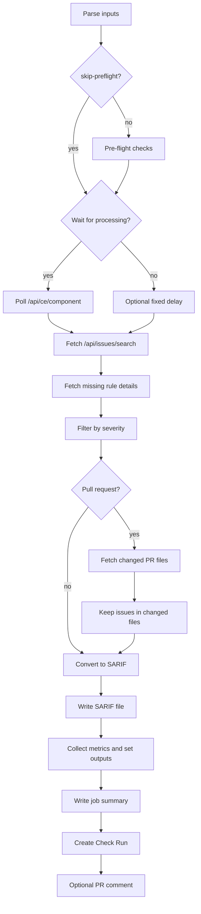

# RFC-001: SonarQube to SARIF Converter

**Status:** Implemented  
**Repository:** `vmvarela/sonarqube-sarif`

## What problem does this solve?

SonarQube can find issues, but it stops short of the workflow most GitHub users expect. There is no native SARIF export, no GitHub Security integration, and no lightweight PR feedback loop. This applies to all editions: Community, Developer, Enterprise, and Data Center.

This action exists to move SonarQube findings into GitHub with the least amount of ceremony possible. It fetches issues from SonarQube, converts them to SARIF, writes the file, creates a Check Run, and optionally posts a PR comment.

The design is opinionated: GitHub should be the review surface, while SonarQube remains the analysis engine.

## The big idea

The action does six things in order:

1. Parse and validate GitHub Action inputs.
2. Run pre-flight checks: URL reachability, token validity, and project key existence.
3. Optionally wait for SonarQube processing to finish.
4. Fetch issues, components, and rule metadata from SonarQube.
5. Filter the result set by severity and, in PRs, by changed files.
6. Convert the remaining issues to SARIF, write the file, and publish feedback back into GitHub.

That gives us one implementation that serves two workflows:

- **PR review:** Check Run + annotations + optional PR comment.
- **Default branch reporting:** SARIF upload into GitHub Security.

## Why this shape makes sense

On Community Edition, SonarQube does not have first-class PR analysis, so the action gives reviewers a useful approximation by intersecting SonarQube issues with the files changed in the pull request.

On Developer Edition and above, SonarQube itself can analyze branches and PRs. In those cases the `branch` input lets you target the specific SonarQube branch result, which makes the filtering more precise.

Either way, the trade-off is honest and practical: reviewers see feedback near their changes, while the GitHub Security tab stays tied to the branch you actually ship.

## Runtime flow

## Modules

The code is intentionally split by responsibility instead of building one oversized `main.ts`.

| Module                   | Responsibility                                                                                 |
| ------------------------ | ---------------------------------------------------------------------------------------------- |
| `src/config.ts`          | Parse inputs, apply defaults, infer PR context, and validate user data.                        |
| `src/preflight.ts`       | Validate URL reachability, token validity, and project key existence before any analysis wait. |
| `src/client.ts`          | Talk to SonarQube, handle pagination, wait for processing, and normalize API responses.        |
| `src/pr-files.ts`        | Ask GitHub which files changed in the PR and filter issues to those files.                     |
| `src/sarif-converter.ts` | Map SonarQube issues and rules into SARIF v2.1.0 structures.                                   |
| `src/stats.ts`           | Compute counts used for outputs, summaries, and gating.                                        |
| `src/github-checks.ts`   | Create the Check Run, annotations, and severity-based failure behavior.                        |
| `src/pr-comment.ts`      | Upsert a single PR comment with summary tables and links.                                      |
| `src/errors.ts`          | Turn transport and validation failures into actionable messages.                               |

## Data contract

The action has a small public surface:

- **Inputs:** SonarQube URL, token, project key, filtering, waiting strategy, PR comment toggle, fail threshold, and output file path.
- **Outputs:** SARIF path plus counts by severity and issue type.

The internal rule is simple: every downstream feature uses the same filtered issue set. The Check Run, PR comment, SARIF file, and output counts should all describe the same reality.

## Important design decisions

### 1. REST first, not cleverness first

SonarQube CE exposes the data we need through REST endpoints. The action uses:

- `/api/issues/search`
- `/api/rules/show`
- `/api/ce/component`
- `/api/authentication/validate` (pre-flight only)
- `/api/projects/search` (pre-flight only)

There is no hidden cache, no local database, and no attempt to derive state that SonarQube does not provide.

### 2. Poll when possible, delay when necessary

Polling gives more predictable results, but it requires permission to read SonarQube compute status. Some teams only grant Browse. For them, `processing-delay` is a blunt instrument, but a useful one.

The implementation supports both because reliability matters more than elegance here.

### 3. PR filtering is by file path, not by blame or diff hunk

The action fetches the changed file list from GitHub and keeps only SonarQube issues whose component path matches one of those files.

That is intentionally conservative:

- simple to explain
- cheap to compute
- resistant to noisy heuristics

It also means old issues in a changed file can still show up. That is a limitation of the source data, not a bug in the filter.

### 4. Check Runs are the fast-feedback channel

GitHub Check Runs are where developers naturally look during review, so the action always tries to create one when a GitHub token is available. The summary is human-readable, and annotations are sorted by severity so the most important findings survive GitHub's 50-annotation cap.

### 5. `fail-on-severity` is independent from SonarQube Quality Gates

This action does not query or mirror SonarQube Quality Gates. The gate here is intentionally narrow: if the filtered issue set contains findings at or above the configured severity, the Check Run fails.

That keeps the behavior obvious and makes it easy to combine with a separate SonarQube Quality Gate step.

### 6. Pre-flight fails fast, before the wait loop

Misconfiguration — wrong URL, expired token, or missing project — used to surface as a cryptic HTTP error after the analysis wait loop finished (up to 5 minutes in). Pre-flight moves those checks to startup: three lightweight API calls that run before any polling or issue fetching.

The trade-off is three extra HTTP requests on every run. That is acceptable given that misconfiguration is a common source of wasted CI time, and the checks are cheap (HEAD for connectivity, single JSON calls for auth and project key).

Teams with air-gapped runners or restricted network policies can opt out with `skip-preflight: true`.

## SARIF mapping

The converter emits SARIF `2.1.0` and keeps the mapping straightforward:

| SonarQube severity | SARIF level |
| ------------------ | ----------- |
| `BLOCKER`          | `error`     |
| `CRITICAL`         | `error`     |
| `MAJOR`            | `warning`   |
| `MINOR`            | `note`      |
| `INFO`             | `note`      |

Security-oriented rules also get a `security-severity` property so GitHub can present them more naturally in the Security UI.

## Failure handling

Most failures fall into four buckets:

1. **Bad configuration** — invalid URL, bad integers, missing token. Caught by `config.ts` before any network call.
2. **Pre-flight failures** — URL not reachable, expired token, or project key not found. Caught by `preflight.ts` at startup, before the analysis wait loop. Each failure emits a specific, actionable message rather than an opaque HTTP error several minutes later. Skippable via `skip-preflight: true` for offline or air-gapped setups.
3. **SonarQube auth or permission problems** — usually `401` or `403` during issue fetching.
4. **Connectivity or timeout issues** — bad host, server unavailable, or slow responses.
5. **Partial GitHub integration issues** — PR comment or Check Run creation fails, but SARIF generation still succeeds when possible.

This split is deliberate. Fetching from SonarQube is core behavior; PR comments are optional sugar. Pre-flight failures are surfaced first so teams don't waste CI minutes waiting for analysis on a misconfigured action.

## Limits and trade-offs

- The SonarQube search API is paginated, so large projects pay a predictable multi-request cost.
- Rule details may require follow-up requests when the issue payload does not include everything needed for SARIF.
- GitHub caps annotations at 50 per Check Run. Issues are sorted by severity (BLOCKER → INFO) before the cap is applied, so the most critical findings always make it in.
- `processing-delay` runs at the start of `waitForProcessing()` as well as when polling is disabled, so it is always applied if non-zero.
- The action prefers completeness over speed: it fetches the full issue set and then filters it.
- There is no incremental baseline mode yet.

## Testing strategy

The project uses Vitest for unit coverage around the parts most likely to regress:

- input parsing and validation
- error classification
- severity filtering and statistics
- SARIF conversion
- GitHub-facing formatting logic

This is the right level of testing for the current design. The action is mostly deterministic transformation code around remote APIs.

## What we are not building

This project is not trying to replace SonarQube, implement a custom code scanner, or emulate paid SonarQube features. It is a translator and feedback bridge that works across all SonarQube editions.

That constraint keeps the code understandable and the behavior predictable.

## Future work worth doing

- Better documentation around branch-specific usage.
- Smarter issue baselining, if SonarQube data makes it possible without guesswork.
- Optional caching if API volume becomes a real bottleneck.

Anything beyond that should justify its complexity against the core promise: get SonarQube CE results into GitHub cleanly.
